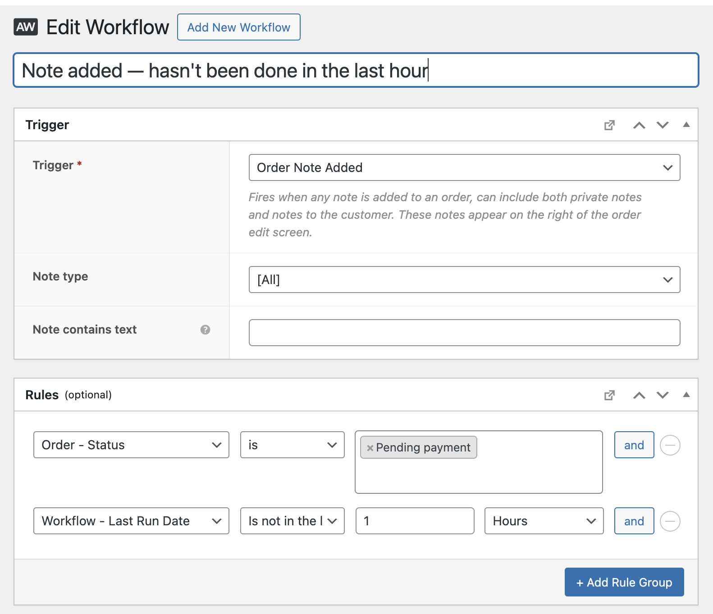

| :exclamation:  This is a public repository |
|--------------------------------------------|

# AutomateWoo Workflow Rule - Last Run Date

Extends the functionality of AutomateWoo with a custom "Workflow" rule which checks the last time a workflow ran.

## Usage

This works similarly to the [AutomateWoo "Workflow – Last Run Date For Customer" rule](https://woocommerce.com/document/automatewoo/rules/list/#section-4), except it checks for when the workflow ran at all, not just for a particular customer. Input your the timeframe to check against. If the workflow ran within the defined timeframe, it will return true.

Tips:
- Is available for any trigger, since it doesn't use a specific order or subscription object

## Support

This plugin is provided without any support or guarantees of functionality. If you'd like to contribute, feel free to open a PR on this repo. If you have a request, please open an issue.

> [!WARNING]  
> Please test thoroughly before deploying to a production site.
